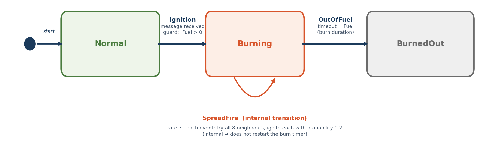
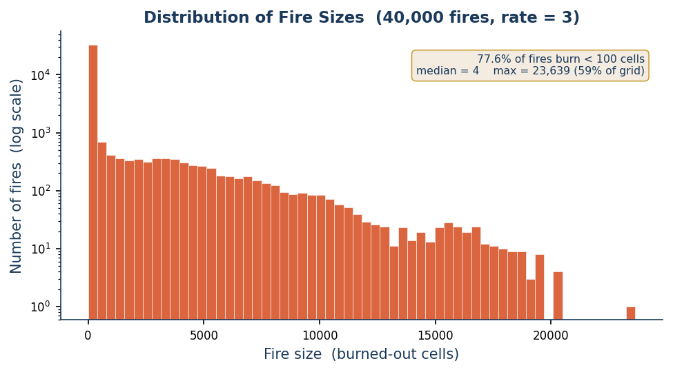
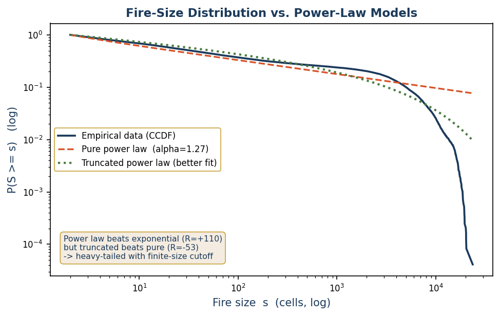

# 🔥 Wildfire Spread Model

**An agent-based simulation of fire propagating across a procedurally generated forest–desert landscape, built in AnyLogic 8.**

A 200×200 grid of cellular agents catches, burns, and dies out through a three-state machine, while fire jumps between neighbours probabilistically — producing emergent fire fronts whose **size distribution** is the object of study. The repository contains the AnyLogic model, the batch experiment that ran **40,000 fires**, and a rigorous statistical analysis of the resulting fire-size distribution against the classic wildfire power law.

`Agent-Based` · `Statechart` · `Cellular Automaton` · `Percolation` · `Poisson spread` · `AnyLogic 8.9`

---

## Table of Contents

1. [Context and Purpose](#1-context-purpose)
2. [Modeling Approach](#2-modeling-approach)
3. [Assumptions & Limitations](#3-assumptions-and-limitations)
4. [System Definition](#4-system-definition)
5. [Model Structure & State Logic](#5-model-structure-state-logic)
6. [Experiments & Scenarios](#6-experiments-scenarios)
7. [Verification, Reproducibility & Inputs](#7-verification-reproducibility-inputs)
8. [Results and Analysis](#8-results-analysis)
9. [Comparison to the Classic Wildfire Power Law](#9-comparison-to-the-classic-wildfire-power-law)
10. [Uses and Learning Reflection](#10-uses-learning-reflection)

---

## 1· Context and Purpose

**Problem.** How large does a wildfire become when it starts at a random point in a heterogeneous forest, and what governs whether it fizzles out or spreads across the landscape?

**Stakeholders.** Students of complex systems, fire-risk analysts, and anyone studying spatial contagion and percolation dynamics.

---

## 2· Modeling Approach

| | |
|---|---|
| **Paradigm** | Agent-Based (cellular) with statechart behaviour — a probabilistic cellular automaton |
| **Space** | Discrete 2D grid for terrain |
| **Tooling** | AnyLogic 8.9 (core agent-based features only; no add-on libraries) |

**Key design choice.** The fire spreads from burning cells to neighbouring cells based on probability. The model does not calculate the final burned area using a fixed analytical equation. This approach was chosen because it is flexible and allows large-scale wildfire patterns to emerge naturally from simple local interactions, rather than being manually predefined.

---

## 3. Assumptions and Limitations

### Assumptions (explicit list)

- The forest can be represented as a grid; each cell is a small area of forest, and the distance between cells is constant.
- Fire spreads only to neighbouring cells; each neighbour has the same basic chance of ignition.
- The probability of transferring fire to a neighbour represents the chance that fire successfully ignites the nearby vegetation.
- Fuel amount affects fire behaviour in a simplified way.

### Limitation

The main limitation of this model is that it represents wildfire spread using simplified local probabilistic rules rather than detailed physical fire dynamics. Therefore, it is suitable for studying emergent spread patterns and statistical behaviour, but it **should not be used as a direct predictive tool for real wildfire events**.

---

## 4· System Definition

| Inside the boundary | Outside the boundary |
|---|---|
| Forest grid with different fuel distribution | Wind |
| Ignition point | Slope |
| Burning / burned cells | Weather |
| Neighbour-to-neighbour spread | Humidity |
| Probability of ignition | Temperature |
| | Firefighters / suppression |

---

## 5· Model Structure and State Logic

**Agent.** The model has a single agent type: the **cell** (`GridCell`, 40,000 instances), each carrying its own `Fuel` value and fire statechart. `Main` is only the container hosting the grid — not a behavioural agent.

**Key function.** `makeInitialFuel` — generates the random forest–desert landscape at startup (seed scattering, smoothing, normalisation, colouring).

### The model at a glance

- **40,000 cellular agents** tile a 600×600 unit space (3 units per 3×3 cell). Each holds a **Fuel** value defining flammability and burn duration.
- **Procedural terrain:** 200 forest seeds with triangular fuel deposition, one smoothing pass, normalised to the range −0.2 … 1.3 — so low values become unburnable desert.
- A fire begins at one cell and spreads outward; the experiment measures the final number of **burned-out** cells — the **fire size**.

### The fire statechart (run independently by every cell)



**How it works.** All 40,000 cells run this statechart independently. A cell waits in **Normal** until an *Ignition* message arrives — from a burning neighbour or the initial ignition point; the guard `Fuel > 0` makes desert ignore it. While **Burning**, the internal **SpreadFire** transition fires repeatedly and probabilistically ignites neighbours — without restarting the burn timer (that is what *internal* means). When the Fuel-length timeout expires, the cell enters **BurnedOut**. The landscape-scale fire front is programmed nowhere — it **emerges** from these local rules.

| State | Meaning |
|---|---|
| 🟢 **Normal** | Unburned vegetation (or desert). Passive: waits for an Ignition message. Leaves only if `Fuel > 0`, so bare ground can never catch fire. |
| 🟠 **Burning** | The active state: the cell is on fire (coloured red). Burn duration equals the cell's Fuel — fuel-rich cells burn longer and therefore spread more. |
| ⚫ **BurnedOut** | Terminal state: fuel exhausted, cell turns ash-grey. No exit transition — a cell can never re-ignite (no regrowth). |

---

## 6· Experiments and Scenarios

| | |
|---|---|
| **Design** | 400 landscapes; for each, 100 random ignition points → **40,000 fires** total |
| **Experiment type** | Parameters Variation drives the landscape seed; each run executes the fire in code via `generateFuelArray`, `simulateOneFire`, and `poissonSample` |
| **Spread setting** | Fuel-weighted Poisson, mean = **3 × Fuel** spread rounds per cell (the near-critical setting) |
| **Output** | One row per fire: `landscape, ignitionPoint, ignitionIndex, burnedOutCells` → CSV |

The batch fire model mirrors the visual statechart exactly: a burning cell spreading at rate 3 for a duration equal to its Fuel performs a **Poisson(3 × Fuel)** number of spread events — so fuel-rich cells burn longer *and* spread more, just as in the animated model.

---

## 7· Verification, Reproducibility and Inputs

### Verification & Validation

- **Verification.** Visual checks — fire spreads only through connected fuel, stalls at desert, and every burning cell eventually reaches BurnedOut (confirming the spread transition is internal and does not reset burn-out).
- **Conservation.** Burned-out count never exceeds fuelled cells; desert ignitions produce zero spread.

### Reproducibility

- **How to run.** Open `Main` and run the visual model to watch a single fire; run the **Parameters Variation** experiment to regenerate the full 40,000-fire dataset.
- **Key parameters.** `N` (grid size = 200), spread rate (3), spread probability (0.2), landscape and fire seeds.
- **Seeding.** Each landscape and each fire is seeded deterministically, so the entire dataset is exactly reproducible.
- **Output file.** `fire_sizes.csv` — columns `landscape, ignitionPoint, ignitionIndex, burnedOutCells`.

### Inputs & Data

- **Controllable inputs.** Grid size, number of forest seeds, spread rate & probability, number of landscapes and ignition points.
- **Stochastic elements.** Forest seed placement (triangular), ignition locations (uniform), spread events (Poisson), and per-neighbour ignition (Bernoulli 0.2).
- **Data sources.** None — the landscape is synthetic by design; the model is theoretical, not data-calibrated.

---

## 8· Results and Analysis

All results come from the **final setting only** (fuel-weighted Poisson spread, rate 3): 400 landscapes × 100 random ignitions = **40,000 fires**. The question is the shape of the fire-size distribution — and whether it follows a power law.

| Metric | Value |
|---|---|
| Fires simulated | **40,000** |
| Fires burning < 100 cells | **77.6 %** |
| Median fire size | **4 cells** |
| Mean fire size | **801 cells** |
| Largest fire | **23,639 cells** (59 % of grid) |
| Fitted tail exponent | **α ≈ 1.27** |



**Figure 1.** Fire sizes are heavily right-skewed: the vast majority of fires burn only a handful of cells, while a small number grow very large. Median fire size is just 4 cells; mean is 801 — the gap is the signature of a heavy tail.



**Figure 2.** Log-log survival function with maximum-likelihood fits (Clauset–Shalizi–Newman). A pure power law captures the body, but the data bends below it at large sizes; a **truncated** power law fits better.

### Formal distribution comparison (Clauset–Shalizi–Newman)

| Power law compared against… | Log-likelihood ratio *R* | p-value | Verdict |
|---|---|---|---|
| Exponential | **R = +110.2** | < 0.001 | ✅ Power law wins — data is heavy-tailed |
| Log-normal | R = −35.9 | < 0.001 | ❌ Log-normal fits better |
| Truncated power law | R = −52.8 | < 0.001 | ❌ Truncated power law fits better |
| Stretched exponential | R = −37.5 | < 0.001 | ❌ Stretched exponential fits better |

> **Rigorous verdict.** The distribution is **decisively heavy-tailed** (it crushes the exponential, R = +110), but it is **not** a pure power law: a truncated power law with a finite-size cutoff describes it better. The honest, provable claim is — *"heavy-tailed, best described by a truncated power law (α ≈ 1.27) with an upper cutoff set by the finite lattice, consistent with near-critical percolation."*

---

## 9· Comparison to the Classic Wildfire Power Law

### The idealized law (Drossel–Schwabl / self-organized criticality)

The famous result is that forest-fire models exhibit a **pure power-law** fire-size distribution, *P(s) ∝ s⁻ᵗ*, with no characteristic scale — the hallmark of **self-organized criticality (SOC)**. It arises from a specific dynamic:

- trees **regrow** continuously at rate *p*;
- lightning strikes at a much rarer rate *f*;
- as *f/p* → 0 the system **drives itself** to the critical point with no manual tuning;
- on an effectively **infinite** lattice, giving a power law across all scales.

### Why this model differs

This model reproduces the heavy tail but **not** the pure power law, for three structural reasons:

1. **No regrowth, no self-organization.** Each fire runs once on a fresh, static landscape. Nothing drives the system to criticality — the spread rate must be **tuned by hand** (here, to 3).
2. **Finite lattice.** A 200×200 grid imposes a hard ceiling, so the largest fires are **truncated** — exactly the cutoff the statistics detected.
3. **Fuel heterogeneity.** Desert barriers chop the landscape, halting many fires early and bending the tail below a clean power law.

**So the difference is expected and correct:** theory predicts a *truncated* power law for a finite, non-self-organizing system — which is precisely what was found.

---

## 10· Uses and Learning Reflection

### What the model is used for

- **Mapping the phase transition.** Shows how one spread parameter flips the system from "fires stay local" to "fires span the landscape."
- **Tail-risk reasoning.** The heavy tail means rare large fires dominate total damage — useful for thinking about worst-case exposure.
- **Intervention leverage.** Near the critical point the system is hypersensitive; small reductions in spread (or added firebreaks) disproportionately cut large-fire risk.
- **Teaching tool.** A clean demonstration of percolation, criticality, and emergent spatial contagion.

### Learning reflection

- **Biggest modelling risk.** The spread rate is uncalibrated — results are structural, not predictive; absolute sizes carry no physical units.
- **Biggest assumption impact.** Omitting wind, slope, and regrowth removes the very mechanism that yields the idealized power law.
- **What I'd improve with more time.** Add wind-biased directional spread and vegetation regrowth to test whether the model then self-organizes toward a cleaner power law; calibrate cell size to real fuel data.

---

## Repository contents

```
├── wildFire.alp          # AnyLogic 8.9 model (visual model + Parameters Variation experiment)
├── fire_sizes.csv        # 40,000-fire dataset (landscape, ignitionPoint, ignitionIndex, burnedOutCells)
├── figures/
│   ├── fig_statechart.png # Fire statechart diagram
│   ├── fig_hist.png      # Figure 1 — fire-size histogram
│   └── fig_powerlaw.png  # Figure 2 — CCDF with power-law fits
└── README.md
```

*Wildfire Spread Model · AnyLogic 8.9 · Model Documentation*
